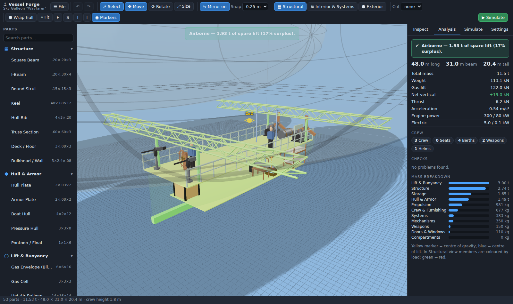

# Vessel Forge — Fantasy Vehicle Creation

A to-scale 3D designer for "realistic" fantasy vehicles: sky ships, airships,
tracked crawlers, walkers, boats, submersibles and spacecraft. You build a
vessel from a frame up, furnish it, plumb and wire it, and the app tells you
whether it would actually fly, float, drive or dive. Then you can shoot holes
in it and watch what happens.



## Running it

```bash
npm install
npm run dev      # http://localhost:5173
npm test         # physics & simulation tests
npm run build    # static build in dist/
```

The first launch opens the **Sky Galleon** template. More templates (Tracked
Crawler, Submersible) are under **☰ File**. Your work autosaves to the browser,
and you can save/open `.vessel.json` files, export a `.glb` 3D model, or take a
screenshot.

## Building

- **Everything is in real metres.** Set the crew height in **Settings**
  (gnome 1.0 m → giant 5 m). New seats, beds, doors and crew figures are sized
  to it, so the interior fits the people who will use it.
- **Pick a part on the left and click in the scene.** Parts snap onto whatever
  surface you click. Plates, doors, windows and lamps orient themselves flat
  against that surface. `R` rotates the part before you place it, `Esc` stops
  placing.
- **Mirror** (`M`) is on by default. Anything placed off the centre line gets a
  linked twin on the other side, and edits to either one apply to both. Use
  *Unlink* in the inspector to let the two sides differ.
- **Gizmo:** `W` move, `E` rotate, `R` resize. Snap is set in the toolbar.
  Arrow keys and PgUp/PgDn nudge the selection.
- **Views** (`1` `2` `3`):
  - **Structural:** hull plating is hidden, and framing is coloured by how
    loaded it is (green → red). Anything not attached to the frame glows
    magenta.
  - **Interior & Systems:** the hull and gasbags turn see-through. Pipes are
    coloured by what they carry, wiring shows yellow, and compartments appear.
  - **Exterior:** the finished look.
- **Cut** slices the model open along the side or front to see inside.
- **Wrap hull** answers the "how do siding and armor work" question: select
  some framing (or nothing, to use all of it) and it generates a skin over the
  skeleton. Set its material and thickness in the inspector. Its surface area
  gives its weight, and its enclosed volume gives its buoyancy. You can also
  place individual hull and armor plates by hand.

## What gets simulated

The **Analysis** tab re-runs on every edit:

| | |
|---|---|
| **Mass & balance** | Every part's mass comes from its material density × volume (solid), surface × thickness (shells, tanks, gasbags), or a catalogue weight. Tank and gasbag contents are included. Also shows the centre of gravity. |
| **Structure** | Contact between parts is found with oriented-box tests. Parts that don't connect back to the main frame are flagged as floating. Each part's weight is passed down to the frame members holding it, and each member's bending capacity (4σS/L) comes from its material strength and cross-section. |
| **Air** | Gas lift = (air density at altitude − gas density) × volume × g. Wing lift = ½ρv²·S·C<sub>L</sub>, plus levitation crystals. Also checks trim: centre of lift vs centre of gravity, and whether it's top-heavy. |
| **Land** | Ground pressure from track, wheel and leg contact area. Rollover angle, wheelbase check and power-to-weight. |
| **Water** | Buoyancy from displacement hulls, draft, reserve buoyancy, and metacentric height (GM = KB + BM − KG) for capsize risk. |
| **Underwater** | Neutral buoyancy with ballast suggestions. Crush depth from thin-wall hoop stress (P = σt/r) against the water pressure at your operating depth. |
| **Space** | Thrust-to-mass acceleration, Δv from the rocket equation, and a warning if crew have no pressurised hull. |
| **Power** | Engine kW against propeller and track demand. Electrical supply reaches lamps, lifts and crystals along the wiring network. |

The **Simulate** tab runs the design over time:

- The craft rises or sinks with its live net lift, and hits the ground if it
  falls.
- Use **💥 Damage** (Shift-click repairs) on pipes, gasbags, tanks, wires or
  anything else.
- A damaged pipe drains every tank and gasbag on its network. The gasbags
  sag and lose lift, and the fluid pours into whichever **compartment** the
  leak is in:
  - **steam** scalds
  - **fuel** gives off toxic, flammable vapour
  - **hydrogen** builds an explosive atmosphere, which a lit lamp, stove or
    engine in the same room will ignite
  - **helium** and exhaust suffocate the crew
  - **water** floods the room
- **Valves** can be closed to isolate a leak. Open doors and hatches vent a
  compartment.
- Crew status (burning, poisoned, suffocating, drowning) comes from the
  compartment each crew member's head is in.
- **Moving parts:** lifts, doors, hatches, cargo ramps, bay doors, turrets,
  and a cargo winch whose chain actually lowers. Operate them from the
  inspector.

## Code layout

```
src/core/       data model, catalogue, materials, fluids, geometry,
                analysis (physics), networks (pipes/wiring), store (undo/mirror),
                hull wrapping, templates
src/sim/        time-stepped damage / leak / atmosphere / vertical-motion sim
src/render/     three.js viewport, procedural part meshes, animation
src/ui/         catalogue, inspector, analysis, simulation and settings panels
test/           vitest suite for the physics and simulation
```

`src/core` and `src/sim` don't depend on the DOM, so they are unit-tested
directly.

To add a part, give it an entry in `src/core/catalog.ts`. Pick a `shape`, a
mass mode and any behaviour flags (`container`, `envelope`, `conduit`,
`thrust`, `mechanism`…). If none of the existing shapes fit, add a mesh
builder in `src/render/meshes.ts`.
